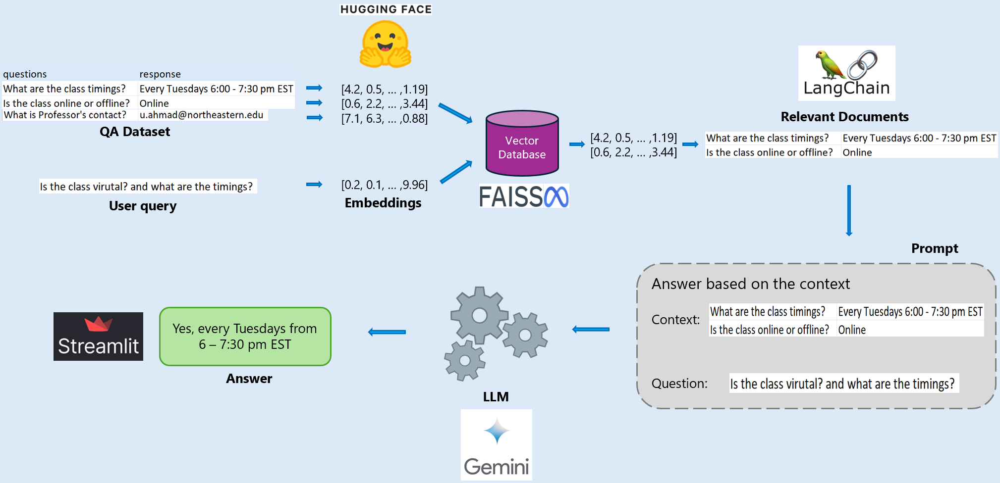

# AI Teaching Assistant: A RAG-based Question Answering System

Developed an AI teaching assistant using RAG and LLM to respond to students' queries virtually, instantly and accurately.

### Motivation:
As a teaching assistant, I find answering numerous repetitive questions from students time-consuming and often frustrating. Students also have to wait until office hours for clarification, leading to wasted time. To solve this, I developed a question-answering system using Retrieval-Augmented Generation and Large Language Models to provide instant and accurate answers about coursework, projects, and assignments. This system eliminates the need for a physical teaching assistant. I created a dataset of question-answer pairs to train and evaluate the model's performance, and I built an interactive web application to support students 24/7. If the model can’t answer a question, it offers the option to notify the TA, opening an Outlook email with the TA’s address prefilled for easy communication.


### Tools/Libraries/Packages:
- Hugging Face Embeddings  ➡️ Text embeddings
- FAISS  ➡️ Vector Database
- LangChain  ➡️ RetrievalQA
- Google Gemini-1.5-Flash  ➡️ LLM
- Streamlit  ➡️ User Interface

### Workflow:


### Instructions to run code:
1.	Clone this repository using: ```https://github.com/baskar-ak/QA_AI_Assistant.git```
2.	Navigate to project directory: ```cd QA_AI_Assistant-main```
3.	Open terminal and install dependencies: ```pip install -U -r requirements.txt```
4.	Run the command: ```python -m streamlit run main.py```

### Sample questions to try:
- Suggest some reference books.
- When can I reach out to Professor?
- What should I submit for the project? Can I submit it late?
